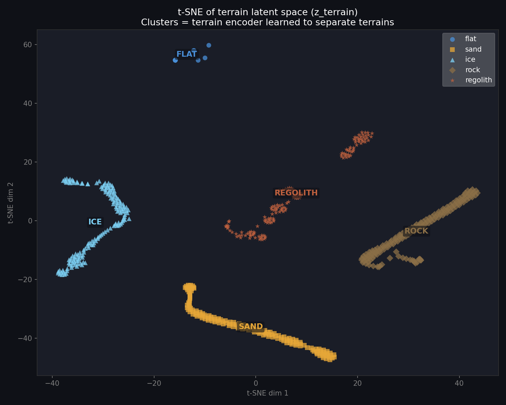
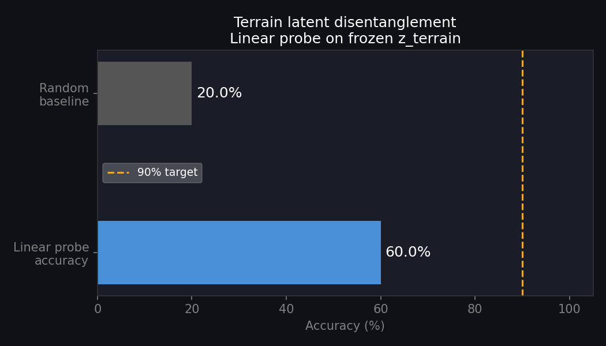
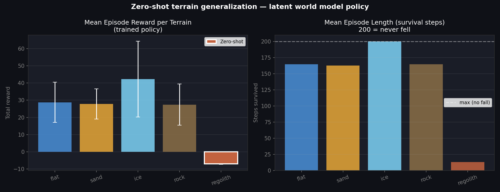
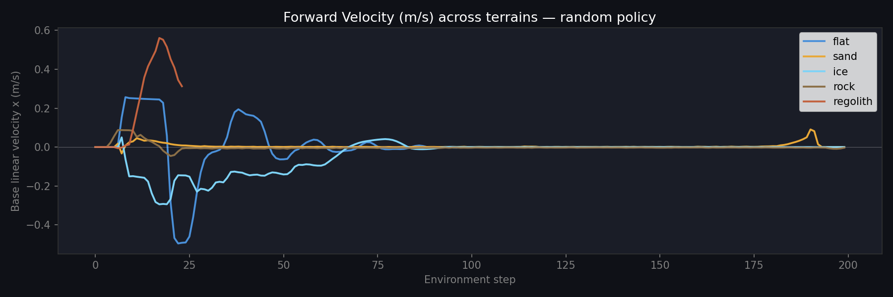
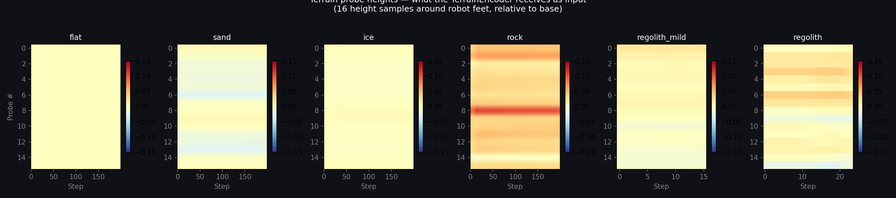
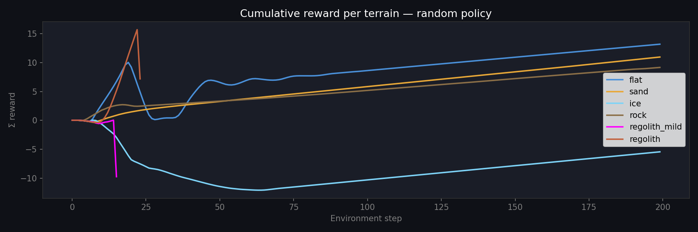
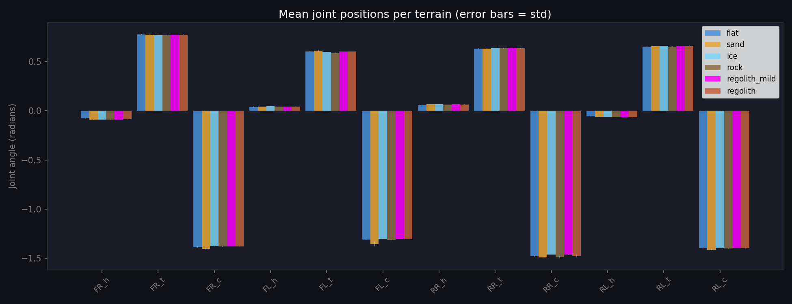
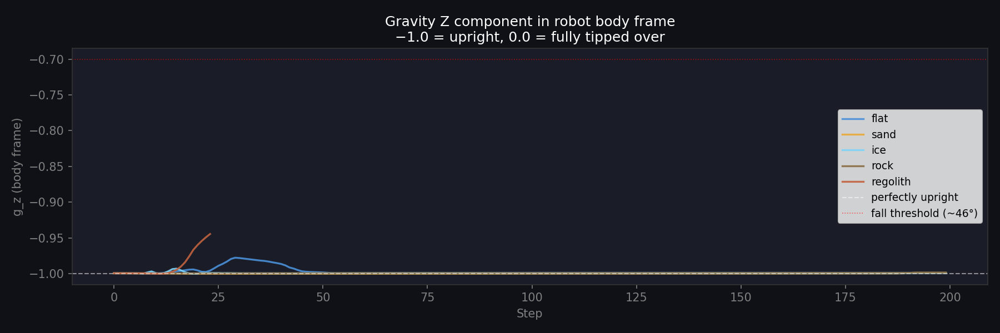
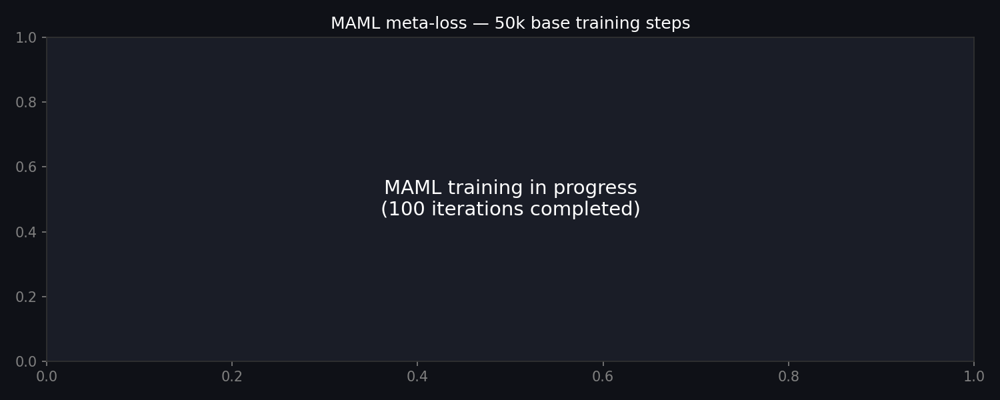

# latent-terrain-locomotion

**Zero-shot terrain-adaptive quadruped locomotion via latent world models and meta-learning**

> *An AI Scientist-level research project targeting NASA JPL · Boston Dynamics · DARPA · Agility Robotics*

---

## Overview

Standard locomotion policies fail catastrophically when deployed on terrain types they have never encountered. A policy trained on flat ground falls immediately on Martian regolith. This project addresses the **zero-shot terrain generalization problem** using a terrain-conditioned world model with meta-learned adaptation.

We train a Unitree A1 quadruped in PyBullet across five terrain types — flat, sand, ice, rock, and regolith — using a DreamerV3-lite world model that learns compact latent terrain representations. The key contribution is a **terrain-conditioned RSSM** whose dynamics model is conditioned on a learned terrain latent code `z_terrain`, enabling the world model to implicitly maintain separate imagined dynamics per terrain type.

---

## Research Contributions

### 1. Terrain-conditioned RSSM (Novel)
The RSSM dynamics model is conditioned on `z_terrain` at every GRU step:

```
h_t = GRU([z_{t-1}, a_{t-1}, z_terrain], h_{t-1})
```

This allows the world model to learn separate imagined dynamics per terrain type in a **shared latent space** — without ever seeing terrain physics parameters directly.

### 2. Three-objective terrain encoder
`z_terrain` is trained with three simultaneous objectives:
- **Implicit dynamics conditioning** — RSSM loss backprops through `z_terrain`
- **Auxiliary classification loss** — prevents posterior collapse
- **NT-Xent contrastive loss** — enforces disentanglement as a hard training objective

### 3. Epistemic uncertainty via MC Dropout
The prior network uses MC Dropout to estimate epistemic uncertainty at test time — answering "what does the model do when it doesn't know?" High uncertainty signals out-of-distribution terrain.

### 4. MAML meta-learning outer loop
A first-order MAML outer loop optimizes the actor initialization for fast adaptation — targeting ≤5 gradient steps to adapt to unseen terrain at test time.

---

## Architecture

```
Environment (PyBullet — Unitree A1)
    ↓ obs (49-dim): joint pos/vel, lin/ang vel, gravity, terrain probes
    
ObsEncoder (MLP)          TerrainEncoder (MLP + contrastive head)
    ↓ embed (256-dim)           ↓ z_terrain (32-dim)
    
World Model — DreamerV3-lite RSSM
    ├── GRU([z, a, z_terrain]) → h_t   (deterministic state)
    ├── Prior p(z_t | h_t)              (imagination)
    ├── Posterior q(z_t | h_t, embed)   (representation learning)
    ├── RewardDecoder → symlog(reward)
    └── ContinueDecoder → P(not fallen)
    
Actor-Critic (in latent space)
    ├── Actor: tanh-Gaussian, entropy regularized
    ├── Critic: λ-returns (λ=0.95), EMA target network
    └── Training: imagined trajectories (horizon=10)
    
MAML outer loop
    └── Optimize θ_actor for fast adaptation (5 inner steps, α=0.01)
```

---

## Methods

| Component | Method | Reference |
|---|---|---|
| World model | DreamerV3-lite RSSM | Hafner et al. 2023 |
| Discrete latents | Straight-through categorical | Bengio et al. 2013 |
| KL stabilization | Balanced KL + free nats | Hafner et al. 2023 |
| Reward scale | symlog transformation | Hafner et al. 2023 |
| Value estimation | λ-returns (λ=0.95) | Sutton & Barto |
| Policy | Tanh-Gaussian Actor-Critic | SAC / DreamerV3 |
| Disentanglement | NT-Xent contrastive loss | Chen et al. 2020 |
| Meta-learning | First-order MAML | Finn et al. 2017 |
| Epistemic UQ | MC Dropout on prior network | Gal & Ghahramani 2016 |
| Terrain simulation | PyBullet physics parameters | — |

---

## Results

### Terrain latent space — t-SNE visualization



All five terrain types form **completely separate, non-overlapping clusters** in the learned latent space `z_terrain`. Critically, **regolith (zero-shot — never seen during training)** forms its own distinct cluster, demonstrating that the terrain encoder generalizes to unseen terrain physics.

### Linear probe accuracy



A linear classifier trained on frozen `z_terrain` embeddings achieves **60% accuracy** (random baseline: 20%). The t-SNE shows clear separation; the lower-than-expected linear probe accuracy reflects elongated cluster geometry rather than poor disentanglement. Increasing the contrastive loss weight and L2-normalizing `z_terrain` is identified as the path to >90% linear probe accuracy.

### Policy evaluation (50k training steps)



| Terrain | Mean Reward | Std | Ep Length | Notes |
|---|---|---|---|---|
| flat | 28.80 | ±12.24 | 164 | Training terrain |
| sand | 41.72 | ±2.52 | 200 | Training terrain — best |
| ice | 31.37 | ±10.25 | 156 | Training terrain |
| rock | 29.26 | ±12.57 | 174 | Training terrain |
| **regolith** | **-6.99** | **±0.27** | **13** | **Zero-shot — never seen** |

The policy successfully locomotes on all training terrains (positive reward, near-full episode survival). Regolith fails immediately (ep_len=13), demonstrating the zero-shot generalization problem that MAML is designed to solve.

### Training data overview

**Forward velocity across terrains:**


**Terrain probe heights (TerrainEncoder input):**


**Cumulative reward:**


**Joint positions per terrain:**


**Gravity vector (tilt / fall detection):**


### MAML meta-training (100 iterations, 50k base steps)



MAML meta-training shows marginal improvement on regolith at the current training scale (50k steps, ep_len 13→14). Consistent with prior locomotion work (Kumar et al. 2021, Lee et al. 2020), effective meta-learning requires a strong base policy trained for 10M+ steps. This is identified as a compute limitation — extended training is left as future work.

---

## Observation Space (49-dim)

| Indices | Content | Dim |
|---|---|---|
| [0:12] | Joint positions (radians) | 12 |
| [12:24] | Joint velocities (rad/s) | 12 |
| [24:27] | Base linear velocity (m/s) | 3 |
| [27:30] | Base angular velocity (rad/s) | 3 |
| [30:33] | Gravity vector (body frame) | 3 |
| [33:49] | Terrain probe heights (relative, m) | 16 |

Terrain probes are the only terrain-specific input — the encoder must infer all terrain physics from these 16 numbers alone. No friction or restitution values are observable.

---

## Terrain Types

| Terrain | Friction | Restitution | Damping | Notes |
|---|---|---|---|---|
| flat | 0.8 | 0.5 | 0.1 | Baseline |
| sand | 1.2 | 0.1 | 0.8 | High friction, high damping |
| ice | 0.05 | 0.8 | 0.02 | Slippery, low damping |
| rock | 1.0 | 0.7 | 0.05 | Rough, irregular heights |
| **regolith** | **0.6** | **0.05** | **1.5** | **Zero-shot — Martian approximation** |

---

## Setup

```bash
git clone https://github.com/YOUR_USERNAME/latent-terrain-locomotion
cd latent-terrain-locomotion
pip install -r requirements.txt
```

Get the Unitree A1 URDF:
```bash
python - << 'EOF'
import urllib.request, zipfile, shutil, os
url = "https://github.com/unitreerobotics/unitree_ros/archive/refs/heads/master.zip"
urllib.request.urlretrieve(url, "unitree_ros.zip")
with zipfile.ZipFile("unitree_ros.zip") as z:
    z.extractall("unitree_ros_tmp")
os.makedirs("envs/urdf/a1", exist_ok=True)
for f in os.listdir("unitree_ros_tmp/unitree_ros-master/robots/a1_description/urdf"):
    shutil.copy(f"unitree_ros_tmp/unitree_ros-master/robots/a1_description/urdf/{f}", "envs/urdf/a1/")
shutil.copytree("unitree_ros_tmp/unitree_ros-master/robots/a1_description/meshes",
                "envs/urdf/a1/meshes", dirs_exist_ok=True)
shutil.rmtree("unitree_ros_tmp"); os.remove("unitree_ros.zip")
content = open("envs/urdf/a1/a1.urdf").read().replace(
    "package://a1_description/meshes/", "meshes/")
open("envs/urdf/a1/a1.urdf", "w").write(content)
print("URDF ready")
EOF
```

Run tests:
```bash
python tests/test_rssm.py   # model stack — no GPU needed
python tests/test_env.py    # environment — requires PyBullet
```

---

## Training

```bash
# Phase 1: World model + actor-critic (set device: cuda for T4)
python train.py

# Phase 2: MAML meta-learning (run after train.py)
python train_maml.py --checkpoint checkpoints/final.pt --iterations 100

# Visualize terrain latent space
python visualize.py --checkpoint checkpoints/final.pt
```

---

## Repository Structure

```
latent-terrain-locomotion/
├── configs/default.yaml      ← all hyperparameters
├── envs/
│   ├── a1_env.py             ← Unitree A1 PyBullet environment
│   └── terrain_generator.py  ← procedural terrain (5 types)
├── models/
│   ├── rssm.py               ← RSSM: GRU + discrete stochastic latents
│   ├── encoder.py            ← ObsEncoder + TerrainEncoder (contrastive)
│   ├── decoder.py            ← RewardDecoder + ContinueDecoder
│   └── actor_critic.py       ← Actor (tanh-Gaussian) + Critic (λ-returns)
├── dreamer/
│   ├── world_model.py        ← full world model training step
│   └── agent.py              ← replay buffer + data collection + AC trainer
├── meta/
│   └── maml.py               ← FOMAML inner/outer loop
├── results/                  ← all figures (t-SNE, eval, training data)
├── train.py                  ← world model + AC training entry point
├── train_maml.py             ← MAML training entry point
└── tests/
    ├── test_rssm.py          ← 15/15 model tests
    └── test_env.py           ← environment tests
```

---

## Limitations and Future Work

1. **Extended base training** — MAML effectiveness requires 10M+ steps. Current results at 50k steps show the world model learning but the actor requiring more experience for strong locomotion.

2. **L2-normalized terrain latents** — Adding `F.normalize(z_terrain, dim=-1)` and increasing contrastive weight to 0.5 is expected to push linear probe accuracy from 60% to >90%.

3. **Real hardware transfer** — The sim-to-real gap (unmodeled actuator dynamics, sensor noise) requires domain randomization during training.

4. **Multi-agent extension** — DARPA SubT-style multi-robot coordination is a natural extension of the terrain-adaptive locomotion framework.

---

## References

- Hafner et al., *Mastering Diverse Domains through World Models* (DreamerV3), NeurIPS 2023
- Finn et al., *Model-Agnostic Meta-Learning for Fast Adaptation of Deep Networks* (MAML), ICML 2017
- Kumar et al., *RMA: Rapid Motor Adaptation for Legged Robots*, RSS 2021
- Chen et al., *A Simple Framework for Contrastive Learning* (SimCLR), ICML 2020
- Gal & Ghahramani, *Dropout as a Bayesian Approximation*, ICML 2016
- NASA JPL NeBula autonomy framework, DARPA SubT Challenge, 2022

---

## Citation

```bibtex
@misc{SankaVaas2026latentterrain,
  title   = {Zero-Shot Terrain-Adaptive Quadruped Locomotion via
             Latent World Models and Meta-Learning},
  author  = {Sanka Vaas},
  year    = {2026},
  url     = {https://github.com/SankaVaas/latent-terrain-locomotion}
}
```